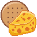
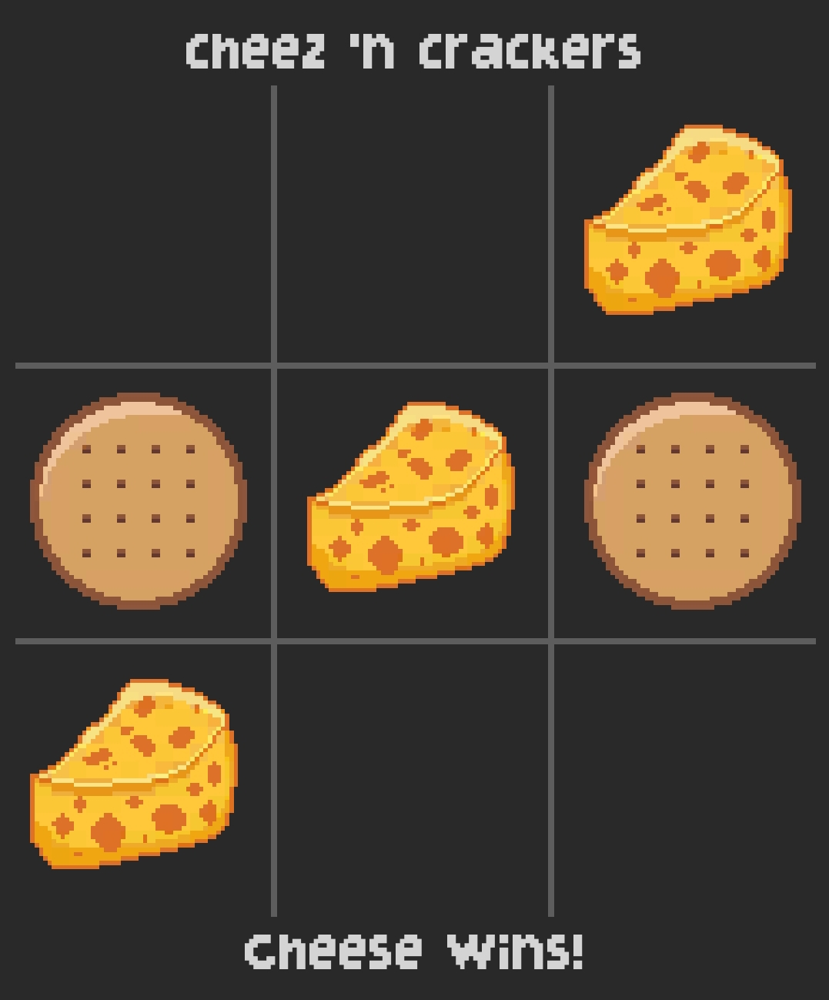

     

# Cheez 'n Crackers

This is a tic-tac-toe game made in Unity. Instead of X's and O's, it's Cheese and Crackers! It's a reference to *Pajama Sam: No Need To Hide When It's Dark Outside*.

## Instructions

* Cheese goes first.
* Take turns tapping on a cell to place your mark there.
* First player to place three-in-a-row wins.
* A full board results in a tie.
* Tap any cell when the game ends to start again.

## Building the Game

This game can be built using Unity 2018.2.16f1 or newer. It may or may not be buildable with previous versions.

## Features

* Turn display
* Winner/tie detection
* Animations
* Mobile compatible

## Preview

## Credits

* Images, code, project by [Ozzy Callooh](http://twitter.com/OzzyCallooh)
* Font: [LycheeSoda](https://www.dafont.com/lycheesoda.font)
